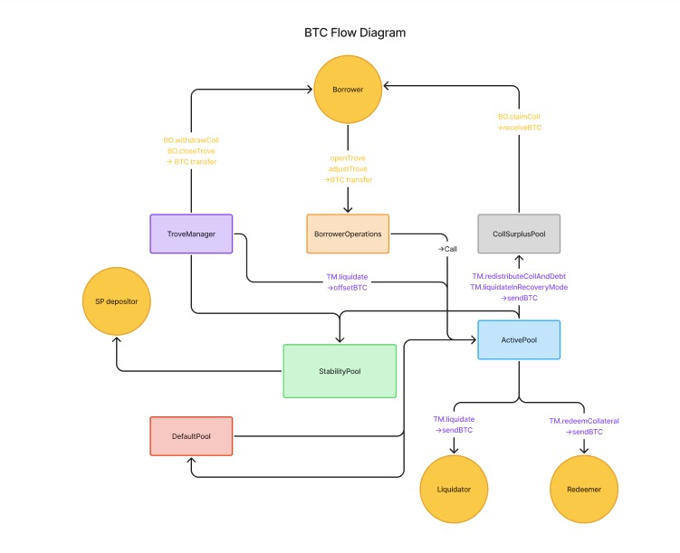
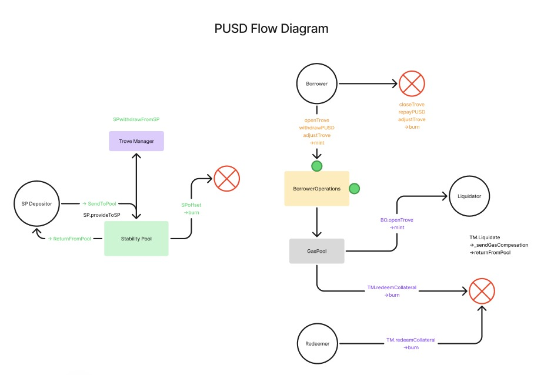
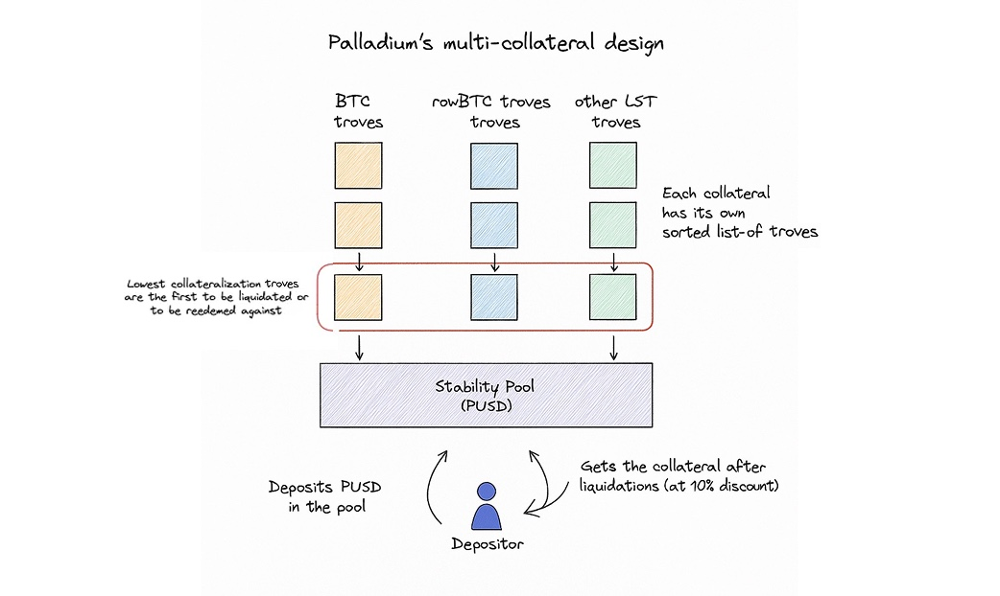

# **Palladium Protocol Documentation**

## **1\. Introduction**

### **1.1 Protocol Overview**

Palladium is a decentralized finance protocol implementing a Collateralized Debt Position (CDP) system. Users can:

- Deposit various supported collateral assets
- Mint stablecoins (debt tokens) against their collateral
- Manage their positions (add/remove collateral, mint/repay debt)
- Participate in liquidations and redemptions

The system maintains price stability through:

- Minimum Collateral Ratio (MCR) requirements
- Liquidation mechanisms
- Dynamic fee structures
- Redemption capabilities

### **1.2 System Architecture**

Palladium's architecture consists of several interconnected components:

### **1.2.1 Core Components**

- **Trove System (TroveManager and BorrowerOperations)**: Manages individual borrower positions
- **Stability Pool**: Acts as first line of defense during liquidations
- **Price Oracle**: Fetches and validates asset prices
- **Liquidation and Redemption System**: Implements liquidation and redemption logic
- **Fee Collector**: Handles protocol fees and revenue distribution

### **1.2.2 Supporting Components**

- **Active Pool**: Holds collateral and debt for active Troves
- **Default Pool**: Holds collateral and debt from liquidated Troves pending redistribution
- **Sorted Troves**: Maintains an ordered list of Troves by collateral ratio
- **Admin Contract**: Stores protocol parameters
- **Collateral Surplus Pool**: Holds excess collateral after liquidations





## **2\. Core Components**

### **2.1 Trove System**

### **2.1.1 Trove Creation and Management**

In Palladium, Troves are individual collateralized debt positions that allow users to mint stablecoins against their
collateral. Each Trove has the following key properties:

- **Collateral**: The amount of assets locked in the Trove
- **Debt**: The amount of stablecoins minted against the collateral
- **Collateral Ratio**: The ratio of collateral value to debt
- **Status**: Active, closed, liquidated, or redeemed

Users can perform several operations on their Troves:

- **Opening a Trove**: Depositing collateral and minting stablecoins
- **Adjusting a Trove**:
  - Adding collateral (increasing security)
  - Removing collateral (decreasing security)
  - Minting additional stablecoins (increasing debt)
  - Repaying stablecoins (decreasing debt)
- **Closing a Trove**: Fully repaying debt and retrieving collateral

The `BorrowerOperations` contract provides user-facing functions for these operations, while the `TroveManager` handles
the internal state changes.

### **2.1.2 Collateral Requirements**

The collateral requirements in Palladium are governed by several key parameters:

- **Minimum Collateral Ratio (MCR)**: Default 110% \- The minimum allowed ratio of collateral to debt for an individual
  Trove. Troves below this threshold are subject to liquidation.
- **Critical Collateral Ratio (CCR)**: Default 150% \- The system-wide threshold that triggers Recovery Mode. When the
  total collateralization of the system falls below this level, additional restrictions are imposed to protect system
  solvency.
- **Minimum Net Debt**: Default 2,000 debt tokens \- The smallest amount of debt a Trove can have (minus the gas
  compensation amount). This prevents dust positions and ensures economic viability of liquidations.

These parameters are stored in the `AdminContract`, which allows for centralized configuration of critical system
values.

### **2.1.3 Debt Issuance**

When a user issues stablecoins from their Trove, several components are involved:

- **Principal**: The actual stablecoin amount requested by the user
- **Borrowing Fee**: A one-time fee applied to new debt issuance (default 0.5%)
- **Gas Compensation**: A reserve kept in the Trove to ensure liquidators can be compensated for gas costs

The total debt of a Trove is the sum of these components. The borrowing fee is collected by the `FeeCollector` contract,
which manages protocol revenue. The gas compensation amount is reserved in the Trove but refunded when the Trove is
properly closed by the owner.

The debt tokens themselves are minted by the `DebtToken` contract, which implements the ERC20 standard with additional
functionalities for minting and burning tokens during Trove operations.

### **2.2 Stability Pool**

The Stability Pool serves as the first line of defense in Palladium's liquidation mechanism. It holds debt token
deposits from users who receive rewards in return for absorbing debt from liquidated Troves.



### **2.2.1 Depositor Incentives**

The Stability Pool incentivizes depositors through two main mechanisms:

- **Liquidation Gains**: When a Trove is liquidated, its collateral (minus a small liquidation fee) is transferred to
  the Stability Pool. This collateral is distributed to depositors proportionally to their deposit size, effectively
  allowing them to purchase collateral at a discount.
- **PDM Rewards**: Stability Pool depositors continuously earn PDM tokens, which are distributed by the
  `CommunityIssuance` contract. These tokens represent a share in the protocol's future value and revenue.

The combination of immediate liquidation gains and long-term token rewards creates a compelling incentive for debt token
holders to participate in the Stability Pool, thereby strengthening the system's overall stability.

### **2.2.2 Liquidation Absorption Mechanism**

When a Trove becomes undercollateralized and is liquidated, the `StabilityPool` contract plays a crucial role in
absorbing the debt:

1. The debt of the liquidated Trove is offset against an equal amount of debt tokens from the Stability Pool.
2. The corresponding amount of collateral from the Trove is transferred to the Stability Pool.
3. The depositors' debt token balances are reduced proportionally to their share of the Stability Pool.
4. The depositors gain a proportional claim to the liquidated collateral.

This mechanism allows the system to efficiently handle undercollateralized positions while providing value to Stability
Pool participants.

The implementation uses a sophisticated mathematical approach to track each depositor's entitlement to collateral gains
and PDM rewards.

### **2.3 Redemption Mechanism**

The redemption mechanism allows debt token holders to redeem their stablecoins for an equivalent dollar value of the
underlying collateral, creating a direct price floor for the stablecoin.

### **2.3.1 Price Floor Maintenance**

The redemption mechanism creates a natural arbitrage opportunity that helps maintain the stablecoin price peg:

1. When the stablecoin trades below $1, arbitrageurs can purchase it at a discount on the open market.
2. They can then redeem it for $1 worth of underlying collateral (minus a redemption fee).
3. This creates buying pressure on the stablecoin, pushing its price back toward the $1 peg.

This direct convertibility ensures that the stablecoin maintains its value close to $1, particularly providing strong
support against downside deviations.

### **2.3.2 Redemption Fees**

To protect the system from excessive redemptions and volatility, Palladium implements a variable redemption fee:

- **Base Rate**: A variable component that increases with redemption activity and decays over time.
- **Redemption Fee Floor**: A minimum fee (default 0.5%) that applies even when the base rate is zero.

The base rate increases with each redemption and decays exponentially over time, helping to moderate large redemption
volumes while still allowing the mechanism to function effectively for price stabilization.

## **3\. Mathematical Models**

### **3.1 Collateral Ratio Calculations**

### **3.1.1 Individual Collateral Ratio (ICR)**

The Individual Collateral Ratio (ICR) is a fundamental metric in Palladium that quantifies the level of
collateralization for a specific Trove. It represents the ratio of the USD value of the collateral to the outstanding
debt.

The formula for ICR is:

$$ICR = (collateral * price) / debt$$

Where:

- `collateral` is the amount of assets in the Trove
- `price` is the current USD price of the asset
- `debt` is the total debt (stablecoins) issued against this collateral

The ICR determines:

- Whether a Trove can be opened or modified (must be ≥ MCR in normal mode)
- Whether a Trove is eligible for liquidation (when ICR \< MCR)
- The order of Troves for redemption (lower ICR Troves are redeemed first)

In the `TroveManager` contract, the `getCurrentICR` function calculates this value using the `PalladiumMath._computeCR`
function.

### **3.1.2 Total Collateral Ratio (TCR)**

The Total Collateral Ratio (TCR) represents the overall collateralization level of the entire system.

$$TCR = (total collateral * price) / total debt$$

Where:

- `total collateral` is the sum of all collateral in the system
- `price` is the current USD price of the collateral
- `total debt` is the total outstanding debt token debt

The TCR is a critical safety indicator that determines the system's mode:

- Normal Mode: When TCR ≥ CCR
- Recovery Mode: When TCR \< CCR

The `TroveManager`'s `_checkRecoveryMode` function compares the calculated TCR against the CCR to determine the system's
current mode.

### **3.1.3 Nominal Collateral Ratio (NICR)**

The Nominal Collateral Ratio (NICR) is a price-invariant representation of a Trove's collateralization, used for
efficiently sorting Troves.

$$NICR = (collateral * NICR_PRECISION) / debt$$

The NICR has two key properties:

- It maintains the same ordering of Troves regardless of asset price fluctuations
- It avoids floating-point arithmetic by scaling with 10^20 (using fixed-point arithmetic)

Troves are sorted by NICR in descending order in the `SortedTroves` contract, which enables efficient:

- Redemption operations (starting from the lowest NICR)
- Liquidation operations (starting from the lowest NICR)

This price-invariant sorting is crucial for the protocol's efficiency and gas optimization.

### **3.2 Fee Models**

### **3.2.1 Borrowing Fee Calculations**

When a user borrows debt tokens by opening or modifying a Trove, a one-time borrowing fee is charged.

$$Borrowing Fee = Borrowing Rate * Debt Amount$$

Where the borrowing rate is configured per asset in the admin contract.

The borrowing fee is calculated in the `TroveManager` contract's `getBorrowingFee` function and is collected by the
`FeeCollector` contract. This fee is added to the user's debt and is non-refundable.

### **3.2.2 Redemption Fee Calculations**

When a user redeems debt tokens for the underlying collateral, a variable redemption fee is applied.

The redemption fee is calculated using the formula:

$$Redemption Fee = Redemption Rate * Asset Drawn$$

Where the Redemption Rate is:

$$Redemption Rate = min(Redemption Fee Floor + Base Rate, DECIMAL_PRECISION)$$

Where:

- `Redemption Fee Floor` is the minimum fee (typically 0.5%)
- `Base Rate` is a variable rate that increases with redemption volume
- `Asset Drawn` is the amount of collateral being redeemed

This calculation is performed in the `TroveManager`'s `_calcRedemptionFee` function, ensuring that redemptions become
progressively more expensive during periods of high redemption activity.

### **3.2.3 Base Rate Adjustment Algorithm**

The Base Rate is a dynamic parameter that adjusts based on redemption activity. It increases with redemptions and decays
over time.

Base Rate Increase Formula:

$$New Base Rate = Decayed Base Rate + (Redeemed Debt Fraction / BETA)$$

Where:

- `Decayed Base Rate` is the current base rate after decay
- `Redeemed Debt Fraction` is (redeemed amount \* price) / total debt token supply
- `BETA` is a constant parameter (default 2\)

Base Rate Decay Formula:

$$Decayed Base Rate = Base Rate * (Decay Factor ^ Minutes Passed)$$

Where:

- `Decay Factor` is a constant (default 0.99903)
- `Minutes Passed` is the time elapsed since the last rate update

The decay factor is chosen such that the half-life of the base rate is 12 hours. This means that after 12 hours without
redemptions, the base rate will decrease by 50%.

These calculations are implemented in the `TroveManager`'s `updateBaseRateFromRedemption` and `_calcDecayedBaseRate`
functions.

### **3.3 Stability Pool Reward Distribution**

### **3.3.1 Compounding Stakes Model**

The Stability Pool implements a sophisticated mathematical model to track depositor gains when liquidations occur. The
key challenge is how to accurately track each depositor's entitlement to liquidation gains as multiple liquidations
occur over time.

Palladium uses a product-sum approach, where several state variables are tracked:

- `P`: a product that represents the compounded effect of liquidations on deposits
- `S`: a sum that tracks accumulated collateral gains per unit of deposit for each collateral type
- `G`: a sum that tracks accumulated PDM token rewards per unit of deposit

Deposit Compounding:

$$Compounded Deposit = Initial Deposit * P / P_initial$$

Where:

- `Initial Deposit` is the original deposit amount
- `P` is the current product
- `P_initial` is the product at the time of deposit

Collateral Gain Formula:

$$Collateral Gain = Initial Deposit * (S - S_initial) / P_initial$$

Where:

- `S` is the current sum
- `S_initial` is the sum at the time of deposit

After each liquidation, `P` is updated by:

$$P = P * (1 - Debt Loss Per Unit Staked)$$

And `S` is updated for each collateral type by:

$$S = S + (Collateral Gain Per Unit Staked * P)$$

This mechanism is implemented in the `StabilityPool` contract's `_updateRewardSumAndProduct` function.

### **3.3.2 Error Correction Mechanisms**

The protocol implements several error correction mechanisms to maintain arithmetic precision despite the limitations of
Solidity's integer arithmetic.

For example, when calculating the collateral gain per unit staked during liquidations, a feedback error correction
approach is used:

1. Adds the previous division error to the numerator
2. Performs the division
3. Calculates the new error by multiplying back and finding the difference
4. Stores this error for the next operation

This ensures that over time, no "dust" is lost due to integer division truncation. The implementation can be seen in the
`StabilityPool` contract's `_computeRewardsPerUnitStaked` function, which tracks errors in the `lastAssetError_Offset`
and `lastDebtTokenLossError_Offset` state variables.

### **3.3.3 Scale Factor Implementation**

To handle very small values of `P` that might result from many large liquidations, the protocol implements a scale
factor mechanism. When `P` becomes too small (\< 1e-9), it is multiplied by 1e9 and a scale counter is incremented. This
prevents `P` from underflowing to zero while maintaining its mathematical properties.

Additionally, if a liquidation completely depletes the Stability Pool, the system increments an "epoch" counter and
resets `P` to 1 and the scale to 0\. This ensures the system can continue to function correctly even after extreme
liquidation events.

These scale changes and epoch updates are handled in the `_updateRewardSumAndProduct` function of the `StabilityPool`
contract.

The mathematical elegance of this approach is that it allows the protocol to track each depositor's entitlement to
rewards with O(1) complexity, regardless of the number of depositors or liquidations.

## **4\. Liquidation System**

### **4.1 Liquidation Conditions**

Liquidation is the process by which undercollateralized Troves are removed from the system to maintain the protocol's
solvency. A Trove becomes eligible for liquidation when its Individual Collateral Ratio (ICR) falls below the Minimum
Collateral Ratio (MCR).

Liquidation can be triggered by any user by calling the liquidation function in the `TroveManagerOperations` contract,
which will check if the target Trove meets the liquidation conditions. The protocol provides gas compensation to
liquidators to incentivize this vital operation.

The primary conditions for liquidation are:

- The Trove must be active (status \== 1\)
- The ICR must be below the MCR
- For Recovery Mode, additional conditions apply

### **4.2 Normal Mode Liquidation**

In Normal Mode (when the Total Collateral Ratio is above CCR), the liquidation process follows these steps:

1. The system checks if the Trove's ICR is below the MCR
2. If eligible for liquidation, the Trove's debt is offset using debt tokens from the Stability Pool
3. A proportional amount of the Trove's collateral is sent to the Stability Pool
4. If the Stability Pool doesn't have enough debt tokens to fully offset the debt, the remaining debt and collateral are
   redistributed to all other active Troves in the system
5. A gas compensation amount is paid to the liquidator from the liquidated collateral

This process is implemented in the `TroveManagerOperations` contract's `_liquidateNormalMode` function, which
coordinates with the `TroveManager` to execute the liquidation.

### **4.3 Recovery Mode Liquidation**

Recovery Mode is activated when the system's Total Collateral Ratio (TCR) falls below the Critical Collateral Ratio
(CCR). In this mode, the liquidation rules change to prioritize system recapitalization:

- Troves with ICR \< 100%:
  - Purely redistributed to other Troves with no Stability Pool offset
- Troves with 100% ≤ ICR \< MCR:
  - Same as Normal Mode liquidation (offset \+ redistribution)
- Troves with MCR ≤ ICR \< CCR:
  - Can be liquidated only if the Stability Pool has enough debt tokens to fully absorb the debt
  - The liquidation is capped at MCR of the debt, with any excess collateral returned to the owner
  - No redistribution occurs for these Troves

These recovery mode rules are implemented in the `TroveManagerOperations` contract's `_liquidateRecoveryMode` function,
which applies different liquidation logic based on the Trove's ICR.

### **4.4 Redistribution Mechanisms**

### **4.4.1 Stability Pool Offset**

The Stability Pool is the first line of defense in the liquidation process. When a Trove is liquidated:

1. The system attempts to offset the entire debt using debt tokens from the Stability Pool
2. For each unit of debt offset, a proportional amount of collateral is sent to the Stability Pool
3. This collateral is then distributed to depositors proportional to their share of the pool

The offset formula is:

$$Collateral to Stability Pool = (Debt Offset / Total Debt) * Collateral$$

This process is implemented in the `offset` function of the `StabilityPool` contract, which is called by the
`TroveManager` during liquidation.

### **4.4.2 Proportional Redistribution to Active Troves**

If the Stability Pool cannot fully absorb a liquidated Trove's debt, the remaining debt and collateral are redistributed
to all other active Troves in the system. This process:

1. Increases the debt of all active Troves proportionally to their existing stake
2. Increases the collateral of all active Troves by the same proportion
3. Maintains the same ICR for all Troves before accounting for price changes

The redistribution is tracked using a system of "reward snapshots" that allows each Trove to claim its portion of
redistributed collateral and debt when it next interacts with the protocol.

This is implemented in the `TroveManager`'s `redistributeDebtAndColl` function, which updates the `L_Colls` and
`L_Debts` variables that track accumulated liquidation rewards per unit staked.

## **5\. Technical Implementation Details**

### **5.1 Contract Architecture**

### **5.1.1 Core Contracts**

Palladium's architecture consists of several specialized contracts that handle different aspects of the protocol:

- **TroveManager**: Tracks the state of all Troves and implements core logic for liquidations and redemptions. It
  maintains data structures for Troves and manages their states throughout their lifecycle.
- **TroveManagerOperations**: Implements operational logic for the TroveManager, including liquidation and redemption
  operations. This separation allows for more modular code and easier upgradeability.
- **BorrowerOperations**: Handles user operations like opening, adjusting, and closing Troves. This contract acts as the
  primary entry point for borrowers interacting with the system.
- **StabilityPool**: Manages deposits and withdrawals from the Stability Pool, as well as liquidation absorption. It
  implements the complex reward distribution mechanisms discussed in section 3.3.
- **SortedTroves**: Maintains an ordered list of Troves by collateral ratio for efficient operations. This specialized
  data structure is crucial for gas-efficient liquidations and redemptions.
- **PriceFeed**: Fetches and validates asset prices from oracles, providing the protocol with reliable price data.

### **5.1.2 Peripheral Contracts**

In addition to the core contracts, several peripheral contracts support the system's operation:

- **ActivePool**: Holds collateral and debt for active Troves. All collateral from active Troves is stored here, and it
  tracks the total debt issued by the system.
- **DefaultPool**: Holds collateral and debt from liquidated Troves pending redistribution. This allows the system to
  efficiently manage liquidated assets.
- **CollSurplusPool**: Stores excess collateral that can be reclaimed by users after liquidations or redemptions.
- **FeeCollector**: Manages protocol fees and their distribution, including borrowing fees and redemption fees.
- **AdminContract**: Stores system parameters and configuration, providing a centralized location for protocol settings.
- **DebtToken**: The ERC20 token representing the stablecoin, with additional functionality for minting and burning
  during system operations.
- **GasPool**: A simple contract that holds the gas compensation for potential liquidations.
- **Timelock**: A contract that enforces time delays for parameter changes, providing an additional security layer.

### **5.1.3 Contract Interactions**

The contracts interact in specific patterns to implement the protocol's functionality:

- **Trove Operations Flow**: User → BorrowerOperations → TroveManager → ActivePool → DebtToken → FeeCollector
- **Liquidation Flow**: Liquidator → TroveManagerOperations → TroveManager → StabilityPool → ActivePool → DefaultPool
- **Redemption Flow**: Redeemer → TroveManagerOperations → TroveManager → ActivePool → FeeCollector
- **Stability Pool Deposit Flow**: User → StabilityPool → DebtToken

These interaction patterns ensure proper separation of concerns while maintaining secure and efficient operations.

### **5.2 Data Structures**

### **5.2.1 TroveData Structure**

In the `TroveManager` contract, each Trove is represented by a struct containing:

```solidity
struct Trove {
	uint256 debt;
	uint256 coll;
	uint256 stake;
	Status status;
	uint128 arrayIndex;
}
```

Where:

- `Status`: Enum representing the Trove's state (nonExistent, active, closedByOwner, closedByLiquidation,
  closedByRedemption)
- `debt`: Total debt token debt of the Trove
- `coll`: Amount of collateral locked in the Trove
- `stake`: The Trove's proportional stake in the system (used for redistribution)
- `arrayIndex`: Position in the Trove owners array

Additional tracking information includes reward snapshots that track pending collateral and debt from redistributions:

```solidity
struct RewardSnapshot {
	uint256 asset;
	uint256 debt;
}
```

### **5.2.2 Stability Provider Data Structure**

The `StabilityPool` contract tracks each depositor's information using a Snapshots structure:

```solidity
struct Snapshots {
	mapping(address => uint256) S;
	uint256 P;
	uint256 G;
	uint128 scale;
	uint128 epoch;
}
```

Where:

- `S`: Mapping from collateral address to sum value, tracking accumulated collateral gains
- `P`: Product value capturing deposit compounding
- `G`: Sum for PDM rewards
- `scale`: Scale factor at time of deposit
- `epoch`: Epoch number at time of deposit

These snapshots enable the system to calculate each depositor's entitled collateral gains and token rewards accurately.

### **5.2.3 System State Tracking**

The protocol tracks several system-wide state variables:

- `totalStakes`: Sum of all Trove stakes in the system
- `totalCollateral`: Sum of all collateral in the system
- `totalDebt`: Sum of all debt in the system
- `baseRate`: Current redemption base rate
- `lastFeeOperationTime`: Timestamp of the last fee-relevant operation

Additional tracking variables include:

- `L_Colls`: Accumulated collateral per unit staked from liquidations
- `L_Debts`: Accumulated debt per unit staked from liquidations
- `totalCollateralSnapshot`: Snapshot of total collateral after the latest liquidation
- `totalStakesSnapshot`: Snapshot of total stakes after the latest liquidation

These variables are updated during key operations to maintain an accurate view of the system's state.

### **5.3 Optimization Techniques**

### **5.3.1 Gas Optimization**

The protocol implements several gas optimization techniques:

- **Batch Processing**: Liquidations can be processed in batches to amortize gas costs. The `TroveManagerOperations`
  contract includes functions like `batchLiquidateTroves` that can handle multiple liquidations in a single transaction.
- **State Caching**: Frequently accessed state variables are cached in memory during complex operations. This is evident
  in functions like `_liquidateNormalMode` where values are stored in local variables to avoid multiple storage reads.
- **Minimal Storage Updates**: State changes are batched to minimize expensive storage operations. For example, the
  `StabilityPool` contract updates multiple state variables in a single function call.

### **5.3.2 Mathematical Optimizations**

The protocol employs several mathematical optimizations to ensure efficient and accurate computation:

- **Fixed-Point Arithmetic**: Instead of using floating-point numbers (which Solidity doesn't support natively), the
  protocol uses scaled integers with a standard precision of 10^18. This approach allows for precise decimal
  calculations without the need for floating-point operations. The `DECIMAL_PRECISION` constant is defined as 1 ether
  (10^18) and used throughout the codebase.
- **Feedback Error Correction**: Division operations in Solidity truncate any remainder. To maintain precision over
  multiple calculations, the protocol implements a feedback error correction mechanism. After each division operation,
  the truncated remainder is calculated and stored, then added to the next calculation. This technique is used
  extensively in fee calculations and reward distributions.
- **Price-Invariant Sorting**: By using Nominal ICR (NICR) for the sorted list of Troves, the protocol avoids having to
  resort the entire list when prices change. The NICR calculation removes the price component while preserving the
  ordering, making the sorting price-invariant.
- **Scale and Epoch Mechanisms**: The StabilityPool implements scale changes and epoch increments to handle extreme
  liquidation scenarios without losing precision or encountering underflow issues.

### **5.3.3 Storage Efficiency**

The protocol optimizes storage usage through several techniques:

- **Packed Structs**: Data types in structs are carefully chosen to allow efficient packing. For example, using uint128
  for scale and epoch values in the Snapshots struct allows them to be packed into a single storage slot.
- **Minimal State Variables**: The protocol only stores essential data in contract state. Derived values are calculated
  on-demand rather than stored, reducing storage costs.
- **Mapping Structures**: The protocol uses nested mappings for efficient access to user data. For example, Trove data
  is stored in a mapping from borrower address to asset address to Trove struct.
- **State Snapshots**: Instead of updating every user's state on global changes (like liquidations), the protocol uses
  snapshot mechanisms that allow users to claim their accumulated rewards only when they interact with the system.
- **Delegation Pattern**: Some contracts delegate functionality to others to avoid code duplication and reduce contract
  sizes. For example, TroveManagerOperations handles the operational logic for TroveManager.

These optimization techniques together make Palladium a gas-efficient protocol that can handle complex financial
operations while keeping transaction costs reasonable for users.

## **6\. Risk Management**

### **6.1 Recovery Mode**

### **6.1.1 Triggers and Conditions**

Recovery Mode is automatically triggered when the system's Total Collateral Ratio (TCR) falls below the Critical
Collateral Ratio (CCR). This is a protective mechanism designed to preserve the system's solvency during periods of
market stress.

The trigger condition is checked at the beginning of any operation that could affect the system's collateralization,
such as:

- Opening or adjusting a Trove
- Liquidations
- Redemptions

The `TroveManager` contract's `_checkRecoveryMode` function performs this check by calculating the current TCR and
comparing it to the CCR.

### **6.1.2 Operational Restrictions**

During Recovery Mode, the following restrictions apply:

**Trove Operations**:

- No collateral withdrawal allowed
- No debt increase allowed unless the resulting ICR is ≥ CCR and the operation improves the Trove's ICR
- Collateral deposits and debt repayments remain unrestricted
- New Troves can only be opened with an ICR ≥ CCR

**Liquidations**:

- Troves with ICR \< MCR can be liquidated as in Normal Mode
- Troves with MCR ≤ ICR \< CCR can be liquidated only if:
  - The Stability Pool has enough debt tokens to fully absorb the debt
  - The liquidation is capped at a recovery-friendly rate (MCR of debt)

**Redemptions**:

- Redemptions can still be performed as normal, as they typically improve system collateralization

These restrictions are implemented in the `BorrowerOperations` and `TroveManagerOperations` contracts. For example, the
`BorrowerOperations` contract enforces restrictions on Trove adjustments in Recovery Mode through the
`_requireValidAdjustmentInCurrentMode` function.

### **6.1.3 System Recovery Process**

The system exits Recovery Mode when the TCR rises back above CCR. This can happen through:

- **Deleveraging**: Liquidations of undercollateralized Troves improve the system's overall collateralization ratio.
- **User Actions**: Voluntary actions like collateral deposits or debt repayments can improve the system's TCR.
- **Market Recovery**: An increase in the price of collateral automatically increases the TCR.

Recovery Mode creates strong incentives for users to improve the system's collateralization:

- Borrowers are incentivized to add collateral or repay debt to avoid being liquidated
- New users are incentivized to open Troves with high collateralization
- Stability Providers are incentivized to deposit more debt tokens to benefit from potential liquidations

This self-healing mechanism helps the system recover from stress without requiring external intervention or governance
actions.

## **7\. Oracle System**

### **7.1 Price Feed Implementation**

Palladium's `PriceFeed` contract implements a robust oracle system for fetching asset price data:

The system supports:

- **Multiple Oracle Providers**: The contract can be configured to use different price oracle providers, including:
  - Chainlink price feeds
  - API3 price feeds
- **Normalized Precision**: All prices are converted to a standard 18-decimal precision format to ensure consistent
  calculations throughout the protocol.
- **Price Validation**: Before returning a price, the system validates it for:
  - Non-zero value
  - Freshness (not stale)
  - Proper format

The oracle plays a critical role in the protocol by determining:

- When Troves become eligible for liquidation
- The collateral value for redemptions
- The system's overall collateralization state

### **7.2 Oracle Failure Handling**

To protect against oracle failures, the system implements several safeguards:

1. **Fallback Oracles**: Each asset can have both a primary and a fallback oracle. If the primary oracle fails to return
   a valid price, the system automatically tries the fallback.
2. **Staleness Checks**: Prices older than a configured timeout period are rejected as stale.
3. **Graceful Error Handling**: If both the primary and fallback oracles fail, the function reverts with a clear error
   message rather than proceeding with an invalid price.
4. **L2-Specific Safeguards**: For L2 deployments, additional checks for sequencer uptime are implemented to prevent
   oracle manipulation during sequencer downtime.

### **7.3 Price Update Frequency and Mechanism**

Price updates are fetched on-demand during key protocol operations rather than being updated on a fixed schedule:

- **Fetch on Use**: Prices are fetched when they are needed for:
  - Opening or adjusting a Trove
  - Liquidating a Trove
  - Redeeming debt tokens for collateral
- **Configurable Timeouts**: Each oracle can have its own staleness timeout configuration

## **8\. Protocol Parameterization**

### **8.1 Key Parameters**

Palladium's operation is governed by several key parameters that balance security, capital efficiency, and usability:

### **8.1.1 Minimum Collateral Ratio (110%)**

The Minimum Collateral Ratio (MCR) of 110% represents the lowest allowed collateralization for an individual Trove. This
parameter balances:

- **Capital Efficiency**: A lower MCR allows borrowers to obtain more liquidity per unit of collateral
- **System Security**: A higher MCR provides more buffer against price volatility

The 110% value is designed to maximize capital efficiency while maintaining system security, particularly for less
volatile collateral assets. This value is stored in the `AdminContract` and accessed by other contracts when needed.

### **8.1.2 Critical Collateral Ratio (150%)**

The Critical Collateral Ratio (CCR) of 150% determines when Recovery Mode is activated. This parameter:

- Provides an early warning system before the overall system approaches unsafe territory
- Creates a substantial buffer (40 percentage points) above the MCR to allow time for corrective actions
- Balances between being too restrictive (higher values) and too permissive (lower values)

The difference between the MCR and CCR provides sufficient time for the system and its participants to react during
market downturns, ensuring smooth operation even during periods of volatility.

### **8.1.3 Other System Parameters**

Additional key parameters include:

- **BETA (2)**: Controls how much the base rate increases with redemptions.
- **MINUTE_DECAY_FACTOR (0.999037758833783000)**: Sets the half-life of the base rate decay to 12 hours.
- **Redemption Fee Floor (0.5%)**: The minimum fee charged for redemptions.
- **Borrowing Fee (0.5%)**: The fee applied to new debt issuance.
- **Minimum Net Debt (2,000 debt tokens)**: The minimum debt a Trove must have.
- **Gas Compensation**: The amount reserved in each Trove to compensate liquidators for gas costs.
- **Percentage Divisor (200)**: Used in various calculations, including gas compensation.

### **8.2 Parameter Optimization**

The parameters in Palladium have been optimized through:

- **Economic Modeling**: Simulation of various market conditions and participant behaviors.
- **Empirical Analysis**: Study of similar protocols' performance under different market conditions.
- **Risk Management Principles**: Conservative settings that prioritize system safety while still providing attractive
  capital efficiency.

## **9\. Implementation Reference**

### **9.1 Core Functions Documentation**

### **9.1.1 Trove Operations**

The core Trove operations are implemented primarily in the `BorrowerOperations` contract:

**Opening a Trove**:

```solidity
function openTrove(
    address _asset,
    uint256 _assetAmount,
    uint256 _debtTokenAmount,
    address _upperHint,
    address _lowerHint
) external override
```

This function:

- Checks that the asset is active
- Calculates the ICR based on the provided collateral and requested debt
- If not in Recovery Mode, triggers the borrowing fee
- Ensures the debt exceeds the minimum required
- Creates the Trove in the TroveManager
- Transfers the collateral to the ActivePool
- Mints the requested debt tokens to the borrower

**Adjusting a Trove**:

```solidity
function _adjustTrove(
    address _asset,
    uint256 _assetSent,
    address _borrower,
    uint256 _collWithdrawal,
    uint256 _debtTokenChange,
    bool _isDebtIncrease,
    address _upperHint,
    address _lowerHint
) internal
```

This function:

- Applies any pending rewards to the Trove
- Calculates the new collateral and debt values
- Checks if the adjustment is valid in the current system mode
- Updates the Trove's state
- Transfers collateral and debt tokens as needed
- Reinserts the Trove in the sorted list based on its new NICR

**Closing a Trove**:

```solidity
function closeTrove(address _asset) external override
```

This function:

- Requires the Trove to be active
- Checks that the system is not in Recovery Mode
- Applies any pending rewards
- Calculates the total debt to be repaid
- Ensures the borrower has sufficient debt tokens to repay
- Burns the debt tokens, releases the collateral, and closes the Trove

### **9.1.2 Stability Pool Operations**

The Stability Pool operations are implemented in the `StabilityPool` contract:

**Providing to Stability Pool**:

```solidity
function provideToSP(
    uint256 _amount,
    address[] calldata _assets
) external override nonReentrant
```

This function:

- Triggers PDM issuance
- Calculates the depositor's gains from previous liquidations
- Updates the deposit amount and snapshots
- Transfers debt tokens from the depositor to the Stability Pool
- Sends any accumulated asset gains to the depositor

**Withdrawing from Stability Pool**:

```solidity
function withdrawFromSP(
    uint256 _amount,
    address[] calldata _assets
) external
```

This function:

- Triggers PDM issuance
- Calculates gains from previous liquidations
- Updates the deposit amount and snapshots
- Transfers debt tokens from the Stability Pool back to the depositor
- Sends any accumulated asset gains to the depositor

**Offset (Liquidation Absorption)**:

```solidity
function offset(
    uint256 _debtToOffset,
    address _asset,
    uint256 _amountAdded
) external override onlyTroveManager
```

This function:

- Triggers PDM issuance
- Calculates rewards per unit staked
- Updates reward sums and products
- Moves collateral from the Active Pool to the Stability Pool
- Reduces the total debt tokens in the Stability Pool by the offset amount

### **9.1.3 Redemption Operations**

The redemption process is implemented in the `TroveManagerOperations` contract:

**Redeem Collateral**:

```solidity
function redeemCollateral(
    address _asset,
    uint256 _debtTokenAmount,
    address _upperPartialRedemptionHint,
    address _lowerPartialRedemptionHint,
    address _firstRedemptionHint,
    uint256 _partialRedemptionHintNICR,
    uint256 _maxIterations,
    uint256 _maxFeePercentage
) external override
```

This function:

- Validates redemption requirements (TCR \> MCR, valid fee percentage)
- Identifies Troves to redeem against, starting with the lowest ICR
- Processes redemptions sequentially until the requested amount is redeemed
- Updates the base rate based on redemption volume
- Calculates and applies the redemption fee
- Finalizes the redemption by burning debt tokens and transferring collateral

**Single Trove Redemption**:

```solidity
function _redeemCollateralFromTrove(
    address _asset,
    address _borrower,
    uint256 _maxDebtTokenAmount,
    uint256 _price,
    address _upperPartialRedemptionHint,
    address _lowerPartialRedemptionHint,
    uint256 _partialRedemptionHintNICR
) internal returns (SingleRedemptionValues memory singleRedemption)
```

This function:

- Determines the amount of debt to redeem from the Trove
- Calculates the corresponding collateral amount
- Applies redemption softening (to account for potential slippage)
- Either fully redeems the Trove (if debt would be zero) or
- Partially redeems it (updating its state and position in the sorted list)

**Base Rate Update**:

```solidity
function updateBaseRateFromRedemption(
    address _asset,
    uint256 _assetDrawn,
    uint256 _price,
    uint256 _totalDebtTokenSupply
) external override onlyTroveManagerOperations returns (uint256)
```

This function:

- Calculates the decayed base rate
- Increases it based on the proportion of the supply redeemed
- Caps it at the maximum value (100%)
- Updates the last fee operation time

### **9.1.4 Liquidation Operations**

The liquidation functions are implemented in the `TroveManagerOperations` contract:

**Single Liquidation**:

```solidity
function liquidate(address _asset, address _borrower) external override
```

This function:

- Checks if the Trove is active
- Creates a single-element array and calls the batch liquidation function

**Batch Liquidation**:

```solidity
function batchLiquidateTroves(
    address _asset,
    address[] memory _troveArray
) public override nonReentrant
```

This function:

- Determines the current system mode (normal or recovery)
- Processes each Trove for liquidation based on the current mode
- Redistributes debt and collateral according to the liquidation rules
- Sends gas compensation to the liquidator
- Updates system snapshots

**Normal Mode Liquidation**:

```solidity
function _liquidateNormalMode(
    address _asset,
    address _borrower,
    uint256 _debtTokenInStabPool
) internal returns (LiquidationValues memory singleLiquidation)
```

This function:

- Retrieves the Trove's debt and collateral
- Moves pending rewards to the Active Pool
- Calculates gas compensation
- Determines the portion of debt to offset with the Stability Pool
- Closes the Trove and updates system state

**Recovery Mode Liquidation**:

```solidity
function _liquidateRecoveryMode(
    address _asset,
    address _borrower,
    uint256 _ICR,
    uint256 _debtTokenInStabPool,
    uint256 _TCR,
    uint256 _price
) internal returns (LiquidationValues memory singleLiquidation)
```

This function:

- Applies different liquidation logic based on the Trove's ICR:
  - ICR \< 100%: Pure redistribution
  - 100% ≤ ICR \< MCR: Standard liquidation
  - MCR ≤ ICR \< TCR: Capped liquidation (if Stability Pool can absorb)
  - ICR ≥ TCR: No liquidation

### **9.2 Key Algorithms Explained**

### **9.2.1 Sorted List Implementation**

The `SortedTroves` contract implements a sorted doubly-linked list data structure that maintains Troves in order of
their NICR (from highest to lowest):

Key functions include:

**Insertion**:

```solidity
function _insert(
    address _asset,
    address _id,
    uint256 _NICR,
    address _prevId,
    address _nextId
) internal
```

Adds a new node to the list at the correct position. Uses hints (`_prevId` and `_nextId`) to efficiently find the
insertion point, and falls back to a search algorithm if hints are invalid.

**Removal**:

```solidity
function _remove(address _asset, address _id) internal
```

Removes a node from the list, updates the previous and next nodes' pointers, and updates head/tail if necessary.

**Find Position**:

```solidity
function _findInsertPosition(
    address _asset,
    uint256 _NICR,
    address _prevId,
    address _nextId
) internal view returns (address, address)
```

Finds the correct position to insert a node with the given NICR. Uses hints if valid, otherwise performs a search.
Returns the addresses of the nodes that should be before and after the new node.

The sorted list is crucial for efficient:

- Redemption operations (starting with lowest ICR)
- Liquidation operations (targeting lowest ICR first)
- Maintaining order as Troves are updated

### **9.2.2 Reward Distribution Algorithm**

The Stability Pool implements a sophisticated reward distribution algorithm that tracks each depositor's entitlement to
liquidation gains:

**Deposit Snapshots**:

```solidity
function _updateDepositAndSnapshots(
    address _depositor,
    uint256 _newValue
) internal
```

This function records the current state of global accumulation variables (`P`, `S`, `G`, `scale`, `epoch`) for a
depositor when they make or update a deposit.

**Update Reward Sum and Product**:

```solidity
function _updateRewardSumAndProduct(
    address _asset,
    uint256 _collGainPerUnitStaked,
    uint256 _debtLossPerUnitStaked
) internal
```

This function:

- Updates the `S` sum for the given asset based on collateral gains
- Updates the `P` product based on debt losses
- Handles scale changes when `P` becomes too small
- Handles epoch changes when the Stability Pool is emptied

**Get Depositor Gains**:

```solidity
function getDepositorGains(
    address _depositor,
    address[] memory _assets
) public view returns (address[] memory, uint256[] memory)
```

This function:

- Calculates gains for each selected asset based on the difference between current and snapshot `S` values
- Accounts for scale changes that may have occurred
- Applies the compounding formula to determine the precise gain

This algorithm achieves O(1) complexity for reward calculations regardless of the number of depositors or liquidations,
making it highly scalable.

### **9.2.3 Redemption Sequence Algorithm**

The redemption sequence algorithm:

- Starts from the Trove with the lowest ICR
- Processes redemptions sequentially, fully or partially redeeming against each Trove
- Continues until the requested amount is redeemed or no more eligible Troves remain

This approach ensures:

- The system's overall collateralization improves after redemptions
- Users with the lowest collateralization are deleveraged first
- The process is gas-efficient through the use of hints and sequential processing

## **10\. Upgrade Path and Governance**

### **10.1 Upgradeability Architecture**

Palladium implements the Upgradeable Proxy Pattern (UUPS) through OpenZeppelin's upgradeability contracts. This enables
the protocol to evolve and improve over time without forcing users to migrate to new contracts.

Key aspects of the upgradeability architecture include:

1. **Proxy Contracts**: Each core contract is deployed behind a proxy that delegates calls to the implementation
   contract.
2. **Storage Layout**: All contracts carefully manage their storage layout to ensure compatibility across upgrades.
3. **Initialization**: Instead of constructors, contracts use initializer functions that can only be called once.
4. **Upgrade Authorization**: The `_authorizeUpgrade` function in each contract controls who can perform upgrades.

### **10.2 Timelock Governance**

To prevent sudden changes to critical parameters, Palladium implements a timelock contract that enforces delays before
parameter changes take effect:

```solidity
function executeTransaction(
    address target,
    uint value,
    string memory signature,
    bytes memory data,
    uint eta
) external payable adminOnly returns (bytes memory)
```

This function executes a transaction only after a predetermined delay has passed since queueing, providing time for
users to observe and react to pending changes.

### **10.3 Parameter Update Process**

The parameter update process follows these steps:

1. A new parameter change is proposed and queued in the Timelock contract
2. The change is subject to a delay period (typically 2 days)
3. After the delay, the change can be executed through the Timelock
4. The relevant contract's parameter is updated

This process applies to key parameters such as:

- Collateral requirements (MCR, CCR)
- Fee parameters (borrowing fee, redemption fee floor)
- Minimum debt requirements
- Redemption settings

### **10.4 Emergency Powers**

For emergency situations, the protocol includes:

1. **Emergency Stop**: The ability to temporarily halt minting of new debt against specific collateral types
2. **Recovery Mode**: Automatic restrictions on system operations when collateralization falls below safe levels
3. **Redemption Block**: The ability to temporarily pause redemptions if necessary

These emergency powers are carefully restricted to minimize centralization risks while providing necessary safeguards.

## **11\. Appendices**

### **11.1 Glossary of Terms**

- **Trove**: Individual collateralized debt position
- **ICR (Individual Collateral Ratio)**: Ratio of a Trove's collateral value to its debt
- **TCR (Total Collateral Ratio)**: Ratio of the system's total collateral value to total debt
- **NICR (Nominal Collateral Ratio)**: Price-invariant version of ICR used for sorting
- **MCR (Minimum Collateral Ratio)**: Minimum allowed ICR for an individual Trove (typically 110%)
- **CCR (Critical Collateral Ratio)**: System-wide threshold for entering Recovery Mode (typically 150%)
- **Recovery Mode**: Special system state activated when TCR \< CCR
- **Stability Pool**: Pool of debt tokens used to absorb debt from liquidated Troves
- **Redemption**: Process of exchanging debt tokens for underlying collateral
- **Liquidation**: Process of removing undercollateralized Troves from the system
- **Base Rate**: Dynamic component of the redemption fee that adjusts with redemption volume
- **PDM**: Palladium's secondary token that captures fee revenue

### **11.2 Mathematical Proofs**

### **11.2.1 Proof of System Solvency**

The protocol maintains solvency through enforced overcollateralization:

- Each individual Trove must maintain ICR ≥ MCR
- Liquidation removes Troves with ICR \< MCR
- Redemptions start from the lowest ICR Troves, improving system collateralization
- Therefore, in normal operation, the system remains overcollateralized

### **11.2.2 Proof of Stability Pool Reward Fairness**

The product-sum approach used for Stability Pool rewards ensures fair distribution:

- Depositors receive collateral gains proportional to their share at the time of liquidation
- The compounding formula correctly accounts for the effects of previous liquidations
- The scale and epoch mechanisms handle edge cases of extreme liquidation events

### **11.2.3 Proof of Price Stability Mechanisms**

The protocol's price stability mechanisms create arbitrage opportunities that help maintain the peg:

- When debt token \< $1: Redemption arbitrage creates buying pressure
- When debt token \> $1: Minting arbitrage creates selling pressure
- These forces work to keep the debt token close to $1 under normal market conditions

### **11.3 Formal Verification Notes**

While a full formal verification is beyond the scope of this documentation, key invariants and properties that should be
verified include:

- **System Solvency**: Total collateral value ≥ total debt \* MCR under all conditions
- **Token Conservation**: Debt tokens cannot be created or destroyed except through proper protocol functions
- **Bounded Loss**: Maximum loss a user can experience is limited to their invested capital
- **Liveness**: Critical functions remain executable under all market conditions

These properties ensure the fundamental safety and liveness guarantees of the protocol.

